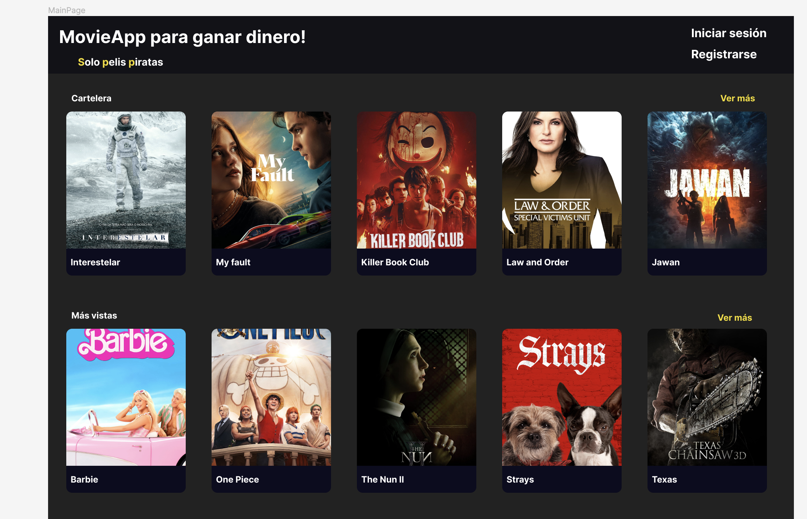

# MovieApp
Aplicación en react usando Next.js. Consume la api The Movie DB (https://www.themoviedb.org/) para traer algunas peliculas y mostrarlas en nuestro fronted.

## Temario

- 1. Instalación de Node js 16.14 o superior
- 2. Crear nuestro proyecto base de react con next.js
- 3. Registrarse en TMDB para acceder a la API y contextualizar
- 4. Figma del proyecto frontend
- 5. Implementar solución.

## Crear proyecto next con typescript

```bash
npx create-next-app@latest --typescript
```


## Levantar servidor en desarrollo

```bash
npm run dev
# or
yarn dev
# or
pnpm dev
```

## Objetivo final


